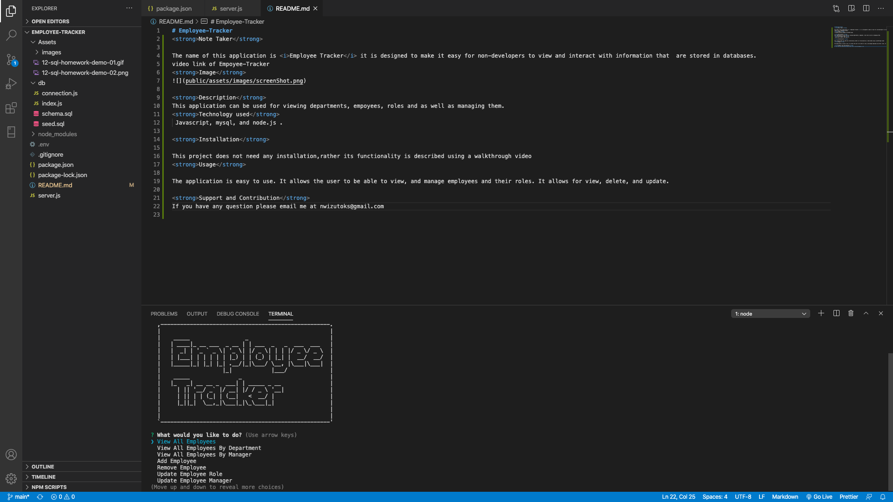

# Employee-Tracker
<strong>Employee-Traker</strong>
The name of this application is <i>Employee Tracker</i> it is designed to make it easy for non-developers to view and interact with information that  are stored in databases.
video link of Empoyee-Tracker
https://drive.google.com/file/d/1EQwcDiR_npK9cBP5l6thQI249PrXhv2e/view
<strong>Image</strong>

<strong>Description</strong>
This application can be used for viewing departments, empoyees, roles and as well as managing them.
<strong>Technology used</strong>
 Javascript,mysql, and node.js . 

<strong>Installation</strong>

This project does not need any installation,rather its functionality is described using a walkthrough video
<strong>Usage</strong>

The application is easy to use. It allows the user to be able to view, and manage employees and their roles. It allows for view, delete, and update.

<strong>Support and Contribution</strong>
If you have any question please email me at nwizutoks@gmail.com
